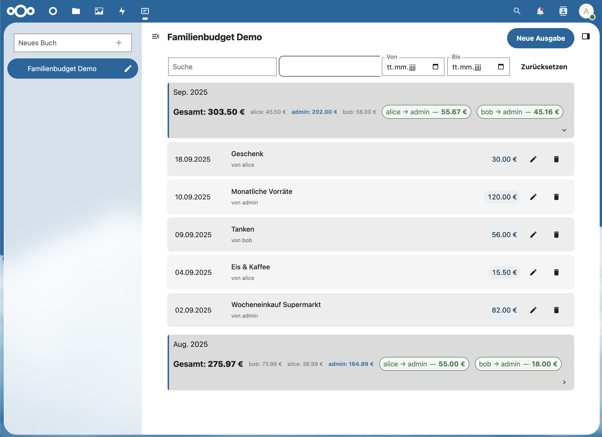

# FamilyBudget – Ausgaben gemeinsam im Blick

FamilyBudget ist eine native Nextcloud‑App, mit der Familien, WGs oder Teams gemeinsame Ausgaben einfach erfassen, teilen und auswerten können. Alles läuft datenschutzfreundlich auf dem eigenen Nextcloud‑Server.

## Highlights

- Multi‑User: Ausgaben pro Person erfassen, gemeinsam einsehen
- Bücher: Mehrere „Haushaltsbücher“ für unterschiedliche Gruppen/Projekte
- Einladungen: Andere Nextcloud‑Nutzer bequem ins Buch einladen
- Filter & Suche: Nach Zeitraum, Person und Text filtern
- Bearbeiten & Löschen: Ausgaben jederzeit anpassen oder entfernen
- Übersicht: Monatliche Liste als Grundlage für faire Aufteilung/Splits
- CSV: Buch vollständig exportieren/importieren (OCS)
- iOS‑App: Im App Store [https://apps.apple.com/de/app/familybudget/id6746215235]

## So funktioniert’s

- Buch anlegen: Erstelle ein Buch (z. B. „Haushalt“, „WG“, „Urlaub“)
- Mitglieder einladen: Lade Nextcloud‑Nutzer in das Buch ein
- Ausgaben erfassen: Betrag, Datum, Beschreibung – fertig
- Nachvollziehen: Jede Ausgabe ist einer Person zugeordnet; alle Mitglieder sehen die Einträge
- Auswerten: Filtere nach Zeiträumen und Personen für einen schnellen Überblick

## Installation

FamilyBudget ist eine reguläre Nextcloud‑App.

- Empfohlener Weg: Über den Nextcloud App‑Store installieren und in der Administrationsoberfläche aktivieren.
- Manuelle Installation (Administratoren):
  1) App‑Ordner `familybudget` in `custom_apps/` der Nextcloud‑Instanz ablegen
  2) App aktivieren: `occ app:enable familybudget`

## Kompatibilität

- Nextcloud: Versionen 27–32
- PHP: ab 8.1

## Berechtigungen & Datenschutz

- Authentifizierung: Es gelten die bestehenden Nextcloud‑Konten und Berechtigungen
- Sichtbarkeit: Daten eines Buchs sind nur für eingeladene Mitglieder sichtbar
- Speicherung: Daten liegen in der Nextcloud‑Datenbank in eigenen Tabellen
  - `fc_books` (Bücher)
  - `fc_book_members` (Mitglieder je Buch)
  - `fc_expenses` (Ausgaben)

## API (optional)

FamilyBudget bietet eine einfache REST‑API innerhalb von Nextcloud, z. B. für mobile Apps. Die wichtigsten Endpunkte sind in `docs/API.md` beschrieben. Authentifizierung über Nextcloud‑Session oder App‑Passwort. CSV‑Export/Import ist über OCS verfügbar.

## Mobile

- iOS: Die iOS findet sich im Applestore oder hier: https://apps.apple.com/de/app/familybudget/id6746215235

## Support & Feedback

- Probleme oder Ideen? Erstelle ein Issue im Repository.
- Website: https://heidkamp.dev

—

Hinweis: Diese README richtet sich an Anwender. Entwickler‑Hinweise (Dev‑Setup, Docker, Build) wurden entfernt, um die Veröffentlichung im App‑Store/Repository nutzerfreundlich zu halten.